# DevSecOps CI/CD Pipeline with Docker & Wazuh SIEM

> **Master's thesis** · MSc Cybersecurity · École Centrale Supérieure Polytechnique Privée de Tunis (Université Centrale)
> **Defended October 2, 2026 — Mention Très Bien (highest distinction)**
> Author: **Niane Mohamed** · [LinkedIn](https://linkedin.com/in/muhammed-niane) · <muhammedniane@gmail.com>

An end-to-end DevSecOps platform built **only with open-source tools** on an **isolated 4-VM lab**: infrastructure provisioned with Terraform and Ansible, a 7-stage GitLab CI/CD pipeline with a **custom scoring-based Security Gate**, and runtime monitoring with **Wazuh SIEM** mapped to **MITRE ATT&CK** — validated against **8 attack scenarios**.


---

## Table of Contents

1. [Overview](#overview)
2. [Architecture](#architecture)
3. [Infrastructure as Code](#infrastructure-as-code)
4. [7-Stage Security Pipeline](#7-stage-security-pipeline)
5. [Custom Security Gate](#custom-security-gate)
6. [Wazuh SIEM](#wazuh-siem)
7. [Attack Scenarios & Results](#attack-scenarios--results)
8. [Lessons Learned](#lessons-learned)
9. [Limitations & Roadmap](#limitations--roadmap)
10. [Repository Structure](#repository-structure)
11. [Skills Demonstrated](#skills-demonstrated)

---

## Overview

### Problem

Most DevSecOps reference architectures assume cloud budgets: managed Kubernetes, managed SIEM, commercial SAST/DAST licenses. Organizations with strict constraints (on-premise only, isolated networks, limited budget) rarely find a blueprint they can actually apply.

### Goal

Design, build and validate a DevSecOps platform that:

- applies **Shift-Left** security (detect in the pipeline, before deployment) and **Shift-Right** monitoring (detect at runtime);
- uses **open-source tools only**;
- runs on an **isolated Host-Only network** with **20 GB RAM** in total;
- is **fully reproducible** through Infrastructure as Code;
- is **validated experimentally** with documented attack scenarios.

### Tech Stack

| Layer | Technologies |
|---|---|
| Control plane | VM-Management · Ubuntu 22.04 · Terraform · Ansible |
| Source & CI/CD | GitLab CE 16.8 · GitLab Runner (Docker executor) · GitLab Container Registry |
| Security scanners | GitLeaks · Semgrep · pip-audit · Trivy |
| Runtime | Docker · Flask sample application |
| SIEM | Wazuh 4.7 (Manager · Indexer · Dashboard) · Filebeat 7.10.2 OSS |
| Threat framework | MITRE ATT&CK |

---

## Architecture



| VM | Role | IP | RAM |
|---|---|---|---|
| VM-Management | Bastion & control plane — Terraform, Ansible | 192.168.137.5 | 2 GB |
| VM1-GitLab | GitLab CE + Runner + Container Registry | 192.168.137.10 | 6 GB |
| VM2-Application | Application runtime (Docker) | 192.168.137.20 | 4 GB |
| VM3-Wazuh | Wazuh SIEM | 192.168.137.30 | 8 GB |

### Design decisions

| Decision | Rationale |
|---|---|
| Host-Only network + NAT egress only | No inbound exposure; simulates an isolated enterprise segment |
| SSH bastion (VM-Management) | Single entry point; internal VMs reachable only through it; key-based auth only |
| Self-hosted GitLab CE + registry | No SaaS dependency; data stays on-premise |
| Docker instead of Kubernetes | Matches the resource constraints of a single-service workload |
| Wazuh + OpenSearch | Open-source SIEM with native MITRE ATT&CK enrichment |

---

## Infrastructure as Code

### Terraform — VM provisioning

A reusable module (`modules/virtualbox_vm`) drives VirtualBox through `VBoxManage` (`null_resource` + `local-exec`): VM creation, hardware, Host-Only networking, disk attachment, and clean teardown on `terraform destroy`. Terraform also generates the Ansible inventory from a template.

```hcl
module "vm1_gitlab" {
  source            = "./modules/virtualbox_vm"
  vm_name           = "VM1-GitLab"
  memory_mb         = 6144
  disk_size_mb      = 51200
  static_ip         = "192.168.137.10"
  host_only_adapter = var.host_only_adapter
  vboxmanage_path   = var.vboxmanage_path
  depends_on        = [module.vm_management]
}
```

### Ansible — configuration management

Playbooks run from VM-Management over SSH. `site.yml` applies one role per responsibility:

| Role | Target | Purpose |
|---|---|---|
| `common` | VM1, VM2, VM3 | Baseline packages, SSH hardening, UFW |
| `docker` | VM1, VM2 | Docker engine |
| `gitlab` / `gitlab_runner` | VM1 | GitLab CE, registry, Docker-executor runner |
| `wazuh_server` | VM3 | Wazuh Manager, Indexer, Dashboard |
| `wazuh_agent` | VM1, VM2 | Agent enrollment |

---

## 7-Stage Security Pipeline



| # | Stage | Tool | What it does | Blocking? |
|---|---|---|---|---|
| 1 | pre-check | GitLeaks 8.18 | Detects hardcoded secrets | **Yes** — hard block on any finding |
| 2 | sast | Semgrep (`p/python`, `p/owasp-top-ten`) + pip-audit | Insecure code patterns + known CVEs in dependencies | No — feeds the Security Gate |
| 3 | build | Docker | Builds the image (non-root user) and pushes it to the GitLab registry, tagged with the commit SHA | On build failure |
| 4 | scan-image | Trivy 0.70 | HIGH/CRITICAL CVEs in the image (OS + language layers) | No — feeds the Security Gate |
| 5 | security-gate | Custom Python | Consolidates all findings into one weighted score | **Yes** — if score < threshold |
| 6 | dast | Docker + curl | Smoke tests (`/`, `/health`, `/info`) against the running container on an isolated, per-job Docker network | On failure |
| 7 | deploy | SSH + Docker | Pulls and runs the image on VM2 | `main` branch only |

- Pre-built CI images (`ci-sast`, `ci-tools`) avoid reinstalling tools on every run.
- A full run takes **about 5 minutes**.
- Every scanner produces a **JSON report** archived as a pipeline artifact — the Security Gate reads them.

---

## Custom Security Gate

The core contribution of the thesis. Instead of making every tool a separate pass/fail blocker (noisy, and it pushes teams to suppress findings), the gate **consolidates all findings into a single score from 0 to 100** and blocks deployment below a threshold.

| Source | Severity | Penalty per finding |
|---|---|---|
| GitLeaks | secret | −50 |
| Trivy | CRITICAL | −10 |
| Trivy | HIGH | −3 |
| Semgrep | ERROR | −5 |
| Semgrep | WARNING | −2 |
| pip-audit | any CVE | −7 |

Weights and threshold are **GitLab CI/CD variables** (`GATE_THRESHOLD`, `GATE_PENALTY_*`): the security policy can be tuned per environment without touching pipeline code.

```python
score = 100
score -= secrets   * PENALTY_SECRET
score -= sast_err  * PENALTY_SAST_ERROR + sast_warn * PENALTY_SAST_WARNING
score -= deps_cves * PENALTY_DEPENDENCY
score -= critical  * PENALTY_CRITICAL   + high * PENALTY_HIGH

score = max(0, score)          # clamp BEFORE the decision (see Lessons Learned)
if score < THRESHOLD:
    print(">>> DEPLOYMENT BLOCKED <<<"); sys.exit(1)
```

The job prints a per-source breakdown, so every decision is traceable and shows where remediation effort should go. Source: [`app/security_gate.py`](app/security_gate.py).

---

## Wazuh SIEM



| Component | Role |
|---|---|
| Wazuh Manager | Decoding, rule engine, correlation, MITRE enrichment |
| Wazuh Indexer | OpenSearch-based event storage |
| Wazuh Dashboard | Security events, MITRE ATT&CK view, per-agent overview |
| Filebeat 7.10.2 OSS | Manager → Indexer forwarding |
| Agents (VM1, VM2) | Collect system logs (auth, firewall, etc.) |

### Native rules used — SSH brute force

| Rule | Description | Level | MITRE |
|---|---|---|---|
| 5710 | sshd: authentication failed | 5 | T1110.001 |
| 5712 | sshd: brute force (8 failures / 120 s, same IP) | 10 | T1110 |
| 5760 | sshd: login attempt with non-existent user | 5 | T1110.001 |
| 5763 | sshd: brute force (multiple) | 10 | T1110 |

### Custom rules — network reconnaissance ([`wazuh/local_rules.xml`](wazuh/local_rules.xml))

```xml
<group name="local,nmap,recon,ufw,">
  <!-- Must inherit from 4100, which swallows UFW logs at level 0 -->
  <rule id="100000" level="5">
    <if_sid>4100</if_sid>
    <match>UFW BLOCK</match>
    <description>UFW: packet blocked from $(srcip) to port $(dstport)</description>
  </rule>

  <!-- 10 blocked packets in 30 s from the same source = port scan -->
  <rule id="100001" level="10" frequency="10" timeframe="30">
    <if_matched_sid>100000</if_matched_sid>
    <same_source_ip />
    <description>nmap scan detected: multiple ports probed from $(srcip)</description>
    <mitre><id>T1046</id></mitre>
    <group>recon,attack,pci_dss_11.4,gdpr_IV_35.7.d,</group>
  </rule>
</group>
```

---

## Attack Scenarios & Results

Each scenario lives in a **dedicated Git branch**, never merged into `main`. Pushing it triggers the pipeline; because deployment runs on `main` only, vulnerable code is never deployed. Runtime exploitation (scenario 5) was demonstrated manually on an isolated port.

| # | Scenario | MITRE ATT&CK | Detected by | Result | Time to detection |
|---|---|---|---|---|---|
| 1 | Hardcoded secrets | T1552.001 | GitLeaks | 4 secrets detected, pipeline blocked at pre-check | ~30 s |
| 2 | Vulnerable code (eval, command injection) | T1059 | Semgrep | 9 findings (7 ERROR + 2 WARNING), score impacted | ~45 s |
| 3 | Vulnerable dependency (Flask 2.0.0) | T1195.001 | pip-audit | 37 CVEs in 7 packages, blocked at threshold 60 | ~60 s |
| 4 | Outdated base image (Debian Buster, EOL) | T1525 | Trivy + Gate | 2 CRITICAL + 45 HIGH, deployment blocked | ~90 s |
| 5 | SQL injection (`/users?id=`, `/search?name=`) | T1190 | Semgrep + manual exploitation | Detected in SAST; `id=1 OR 1=1` confirmed exploitable at runtime | ~40 s + manual |
| 6 | SSH brute force (Hydra, 15 passwords) | T1110.001 | Wazuh 5710 → 5712 | Level 5 → level 10 escalation | < 10 s |
| 7 | Network scan (`nmap -sS -p 1-1000`) | T1046 | Wazuh custom 100001 | 362 level-10 alerts, MITRE-enriched | < 30 s |
| 8 | Supply-chain attack (multi-vector) | T1195.002 | All tools | Secrets blocked first; without secrets, −490 penalty points → blocked | ~120 s |

**MITRE ATT&CK coverage:** 7 techniques across 5 tactics — Initial Access, Execution, Persistence, Credential Access, Discovery.



---

## Lessons Learned

1. **Test your security controls, not just your application.** The first gate compared a raw score (e.g. −490) with the threshold while displaying a clamped value, so display and decision disagreed. Clamping to 0 *before* the comparison fixed it.
2. **Native rules can hide what you need.** Wazuh rule 4100 absorbs UFW logs at level 0, so a custom rule matching UFW directly never fired. `wazuh-logtest` revealed the cascade; the fix was to inherit with `<if_sid>4100</if_sid>`.
3. **Version compatibility matters in open-source stacks.** Filebeat 8.x is incompatible with the Wazuh Indexer; Filebeat 7.10.2 OSS is required.
4. **Testing a container from a CI job needs its own network.** `localhost` from the job container does not reach the app; a per-job Docker network with DNS resolution does — and `after_script` guarantees cleanup.
5. **Vulnerabilities drift without code changes.** Re-running the same `main` commit five months later (May → October 2026), Trivy reported **6 CRITICAL / 111 HIGH instead of 3 / 23**: new CVEs were published against unchanged packages. Image scanning must be continuous, not one-shot.
6. **Prefer ephemeral credentials in CI.** A long-lived personal access token used for registry login expired and broke the pipeline. Switching to GitLab's per-job `CI_JOB_TOKEN` removed the failure mode — and a high-privilege token from CI variables.

---

## Limitations & Roadmap

Documented honestly in the thesis:

- **DAST is limited to smoke tests.** → Planned: OWASP ZAP baseline / full scan.
- **Pipeline and SIEM run in silos** — pipeline findings are not forwarded to Wazuh. → Planned: forward findings from the runner to Wazuh with a custom decoder and MITRE-mapped rules, making Wazuh the single correlation point.
- **Secrets are stored as GitLab CI variables.** → Planned: HashiCorp Vault.
- **No automated response.** → Planned: Wazuh Active Response (e.g. block source IP on rules 100001 / 5712) and notifications for level ≥ 10 alerts and gate blocks.
- **Lab only**, single-host Docker, no high availability. → Possible evolution towards K3s and GitOps.

---

## Repository Structure

```
.
├── app/                     # The GitLab project: sample Flask app + 7-stage pipeline
│   ├── .gitlab-ci.yml       # Pipeline definition
│   ├── security_gate.py     # Security Gate scoring engine
│   ├── Dockerfile
│   └── src/                 # app.py, requirements.txt
├── terraform/               # VM provisioning (VirtualBox module + inventory template)
├── ansible/                 # Configuration management: site.yml + 6 roles
├── wazuh/
│   └── local_rules.xml      # Custom detection rules 100000 / 100001
└── docs/                    # Architecture diagrams
```

> The code targets the isolated lab described above (fixed IPs, VirtualBox driven from WSL2 on Windows). Copy `terraform/terraform.tfvars.example` to `terraform/terraform.tfvars` and adapt the paths before use.
> The attack-scenario branches are **not** published: they contain intentionally vulnerable code and demo credentials.

---

## Skills Demonstrated

- **Infrastructure as Code:** Terraform (reusable modules), Ansible (roles, Jinja2 templates)
- **CI/CD engineering:** GitLab CI, Docker executor, container registry, artifacts, pipeline optimization
- **Application security:** secrets detection, SAST, SCA, container scanning, DAST, risk-scoring gate
- **SIEM engineering:** Wazuh deployment, custom correlation rules, rule debugging, MITRE ATT&CK mapping
- **Offensive validation:** Hydra, nmap, SQL injection, supply-chain attack simulation
- **Security engineering practice:** defense in depth, least privilege, honest limits and roadmap

---

## License

MIT — see [LICENSE](LICENSE). Published for educational purposes; adapt with appropriate hardening (TLS everywhere, secrets management, HA SIEM) before any production use.

## Contact

**Niane Mohamed** — Network & Security Engineer · Nouakchott, Mauritania
📧 <muhammedniane@gmail.com> · 🔗 [LinkedIn](https://linkedin.com/in/muhammed-niane)
